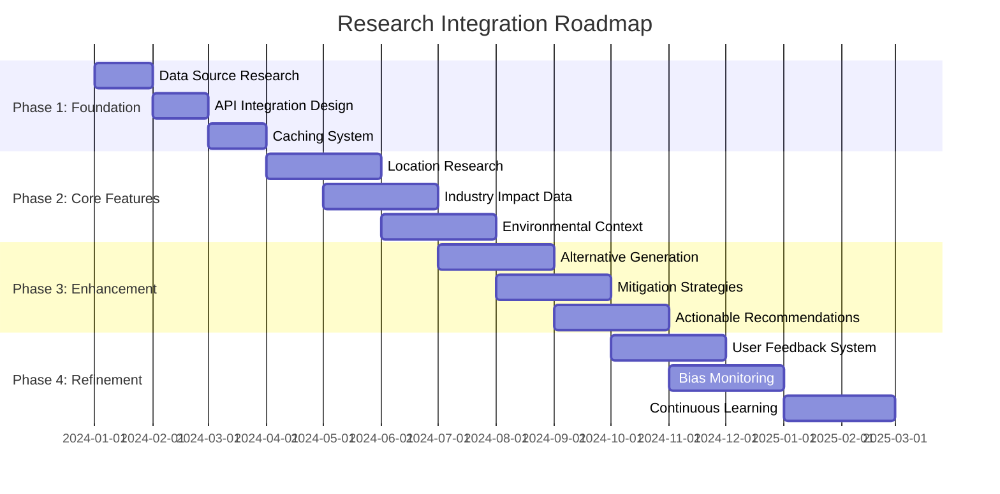

# 🚀 Compass-io CLI - Future Vision

## 🌱 Long-Term Roadmap: Research Integration

This document outlines the exciting future vision for Compass-io CLI, focusing on how the system can evolve to include automated research and contextual data gathering to enhance ethical analysis.

## 🎯 Current State vs. Future Vision

### Current Capabilities
```
User Input (Natural Language) → NLP Parsing → Ethical Analysis → Results
```
- ✅ Natural language understanding
- ✅ Ethical scenario parsing
- ✅ Multiple ethical models
- ✅ Lens-based analysis
- ✅ Red flag detection

### Future Vision
```
User Input → NLP Parsing → Context Research → Enhanced Analysis → Actionable Recommendations
```

## 🔮 Research Integration Framework

### 1. Location-Based Research

**Example Scenario:** "building a 200-unit apartment complex in Portland, Oregon near the Willamette River"

**Future Capabilities:**
- **Automatic Location Analysis:**
  - Identify local ecosystems (Willamette River, urban wetlands)
  - Find protected species (Chinook salmon, Bald eagles)
  - Retrieve environmental regulations (Clean Water Act, local zoning)
  - Gather community demographics and vulnerability data

- **Ecosystem Impact Assessment:**
  - Species habitat analysis
  - Water quality considerations
  - Flood risk assessment
  - Biodiversity impact modeling

- **Community Impact Analysis:**
  - Housing market effects
  - Gentrification risk assessment
  - Displacement potential
  - Local economic impact

### 2. Industry-Specific Research

**Example Scenario:** "developing an AI-powered hiring system for a large corporation"

**Future Capabilities:**
- **Industry Impact Database:**
  - Common biases in hiring algorithms
  - Legal and ethical guidelines
  - Case studies of similar systems
  - Best practices for fairness

- **Regulatory Compliance:**
  - EEOC guidelines
  - Local anti-discrimination laws
  - Data privacy regulations
  - AI ethics frameworks

- **Risk Assessment:**
  - Bias amplification potential
  - Job market impact
  - Workforce diversity effects
  - Long-term societal consequences

### 3. Environmental Impact Research

**Example Scenario:** "constructing a new highway through a forested area"

**Future Capabilities:**
- **Ecosystem Mapping:**
  - Identify keynote species
  - Map ecological corridors
  - Assess habitat fragmentation risk
  - Model climate resilience

- **Alternative Analysis:**
  - Compare different route options
  - Evaluate mitigation strategies
  - Assess green infrastructure options
  - Model long-term ecological effects

- **Regulatory Context:**
  - Environmental impact assessment requirements
  - Protected species considerations
  - Water quality regulations
  - Carbon footprint analysis

### 4. Technological Impact Research

**Example Scenario:** "deploying facial recognition in public spaces"

**Future Capabilities:**
- **Technology Assessment:**
  - Accuracy rates across demographics
  - Known bias patterns
  - Privacy implications
  - Surveillance concerns

- **Societal Impact:**
  - Civil liberties implications
  - Chilling effects on behavior
  - Potential for abuse
  - Long-term social consequences

- **Alternative Solutions:**
  - Privacy-preserving technologies
  - Community-based approaches
  - Transparency mechanisms
  - Oversight frameworks

## 🛠️ Technical Implementation Vision

### Research Data Sources

```python
class ResearchDataSources:
    def __init__(self):
        self.sources = {
            "environmental": {
                "primary": ["EPA databases", "USGS data", "Local environmental agencies"],
                "secondary": ["Academic studies", "NGO reports", "Citizen science data"],
                "real_time": ["Satellite imagery", "Sensor networks", "Community reports"]
            },
            "demographic": {
                "primary": ["Census data", "Local government statistics"],
                "secondary": ["Community surveys", "NGO reports", "Academic research"],
                "real_time": ["Social media analysis", "Community feedback platforms"]
            },
            "regulatory": {
                "primary": ["Government databases", "Legal databases"],
                "secondary": ["Industry guidelines", "Ethical frameworks"],
                "real_time": ["Policy updates", "Case law databases"]
            }
        }
```

### Research Workflow

```python
def enhanced_analysis_workflow(user_input: str) -> Dict:
    """
    Future: Complete research-enhanced analysis workflow
    """
    
    # Step 1: Natural language parsing
    scenario = parse_natural_language(user_input)
    
    # Step 2: Context extraction
    context = extract_context(scenario)
    # - Locations
    # - Industries
    # - Technologies
    # - Timeframes
    
    # Step 3: Automated research
    research_data = gather_contextual_data(context)
    # - Location analysis
    # - Industry impact data
    # - Environmental factors
    # - Regulatory context
    
    # Step 4: Enhanced entity extraction
    enhanced_entities = create_enhanced_entities(scenario, research_data)
    # - Add real-world vulnerability data
    # - Include ecosystem specifics
    # - Incorporate demographic insights
    
    # Step 5: Ethical analysis with context
    ethical_result = ethical_functions.minimize_suffering(
        entities=enhanced_entities,
        model_name=scenario.model,
        lens_names=scenario.lenses,
        context=enhanced_context
    )
    
    # Step 6: Generate actionable recommendations
    recommendations = generate_recommendations(ethical_result, research_data)
    
    return {
        "original_analysis": ethical_result,
        "contextual_data": research_data,
        "enhanced_recommendations": recommendations,
        "mitigation_strategies": generate_mitigation_strategies()
    }
```

### Example: Apartment Building Analysis

**User Input:**
```
"building a 200-unit apartment complex in Portland, Oregon near the Willamette River"
```

**Future Enhanced Analysis:**

```json
{
  "parsing": {
    "entities": [
      {"type": "HUMAN", "count": 200, "description": "Future residents"},
      {"type": "ECOSYSTEM", "count": 1, "description": "Willamette River area"}
    ],
    "model": "eco_systemic",
    "lenses": ["fragility", "deep_time"]
  },
  "contextual_research": {
    "location": {
      "city": "Portland, OR",
      "ecosystems": ["Willamette River", "Urban wetlands"],
      "protected_species": ["Chinook salmon", "Bald eagles"],
      "regulations": ["Clean Water Act", "Portland Wetlands Ordinance"],
      "community": {
        "demographics": "Mixed income neighborhood",
        "vulnerability": "Medium gentrification risk",
        "housing_market": "High demand, low affordable housing"
      }
    },
    "industry": {
      "typical_impacts": ["Habitat disruption", "Water runoff", "Traffic increase"],
      "best_practices": ["Green building certification", "Community benefit agreements"],
      "alternatives": ["Adaptive reuse of existing buildings", "Smaller scale development"]
    },
    "environmental": {
      "ecosystem_value": "High biodiversity, flood control",
      "threats": ["Urban development", "Pollution", "Invasive species"],
      "mitigation": ["Wetland preservation", "Green infrastructure", "Wildlife corridors"]
    }
  },
  "enhanced_analysis": {
    "suffering_score": 45.8,
    "impact_level": "HIGH",
    "contextual_red_flags": [
      "Endangered species habitat",
      "High gentrification risk area",
      "Floodplain development concerns"
    ],
    "enhanced_suggestions": [
      "Conduct full environmental impact assessment",
      "Implement 30% affordable housing requirement",
      "Create wildlife protection buffer zones",
      "Develop community benefit agreement",
      "Pursue LEED Platinum certification"
    ]
  },
  "actionable_recommendations": {
    "immediate": [
      "Consult with local environmental groups",
      "Engage community in planning process",
      "Conduct cultural resource survey"
    ],
    "design": [
      "Incorporate green roofs and rain gardens",
      "Design wildlife-friendly landscaping",
      "Include community spaces and amenities",
      "Plan for pedestrian and bike accessibility"
    ],
    "mitigation": [
      "Create habitat restoration plan",
      "Establish affordable housing fund",
      "Develop local hiring program",
      "Implement long-term monitoring"
    ]
  }
}
```

## 🌍 Implementation Strategy

### Phase 1: Data Source Integration (3-6 months)
- **API Connections:** Connect to environmental and demographic databases
- **Cache System:** Implement caching for frequently accessed data
- **Fallback Mechanisms:** Graceful degradation when data unavailable
- **User Feedback:** Allow manual data correction and enhancement

### Phase 2: Contextual Analysis (6-12 months)
- **Location Intelligence:** Geospatial analysis capabilities
- **Impact Modeling:** Predictive models for various scenarios
- **Alternative Generation:** AI-assisted alternative solutions
- **Regulatory Mapping:** Automated compliance checking

### Phase 3: Actionable Recommendations (12-18 months)
- **Mitigation Planning:** Automated mitigation strategy generation
- **Stakeholder Mapping:** Identify affected parties and interests
- **Implementation Roadmaps:** Step-by-step guidance
- **Monitoring Frameworks:** Long-term impact tracking

## 🤖 AI and Automation Vision

### Intelligent Research Agent
```python
class ResearchAgent:
    def __init__(self):
        self.capabilities = [
            "web_search",
            "database_query",
            "document_analysis",
            "geospatial_analysis",
            "impact_modeling"
        ]
    
    def research_location(self, location_desc: str) -> Dict:
        """Comprehensive location research"""
        # 1. Geocode location
        # 2. Query environmental databases
        # 3. Analyze demographic data
        # 4. Check regulatory context
        # 5. Assess cultural significance
        return comprehensive_location_report
    
    def analyze_impacts(self, scenario: Dict) -> Dict:
        """Predict and analyze potential impacts"""
        # 1. Environmental impact modeling
        # 2. Social impact assessment
        # 3. Economic impact analysis
        # 4. Cultural impact evaluation
        # 5. Long-term consequence modeling
        return impact_assessment_report
    
    def generate_alternatives(self, scenario: Dict) -> List[Dict]:
        """Generate alternative approaches"""
        # 1. Identify key impact areas
        # 2. Research mitigation strategies
        # 3. Generate creative alternatives
        # 4. Evaluate trade-offs
        # 5. Rank by ethical impact
        return ranked_alternatives
```

### Adaptive Learning System
```python
class AdaptiveEthicsSystem:
    def __init__(self):
        self.learning_modules = [
            "user_preference_learning",
            "impact_pattern_recognition",
            "mitigation_effectiveness_tracking",
            "regulatory_change_monitoring"
        ]
    
    def learn_from_feedback(self, user_feedback: Dict):
        """Improve recommendations based on user feedback"""
        # 1. Analyze feedback patterns
        # 2. Adjust recommendation weights
        # 3. Refine impact predictions
        # 4. Update mitigation strategies
    
    def adapt_to_context(self, context: Dict):
        """Adjust analysis based on specific contexts"""
        # 1. Cultural context adaptation
        # 2. Regional regulation awareness
        # 3. Industry-specific considerations
        # 4. Local priority alignment
```

## 🎯 Ethical Considerations for Research Integration

### Privacy and Data Ethics
- **Anonymization:** Protect individual privacy in demographic data
- **Consent:** Ensure data usage complies with ethical standards
- **Transparency:** Clearly disclose data sources and limitations
- **Bias Awareness:** Monitor for and mitigate data biases

### Responsible Automation
- **Human Oversight:** Critical decisions require human review
- **Explainability:** Make automated research transparent
- **Fallback Options:** Always provide manual override capabilities
- **Error Handling:** Graceful degradation when data is uncertain

### Continuous Improvement
- **Feedback Loops:** Learn from user corrections and enhancements
- **Bias Monitoring:** Regularly audit for systemic biases
- **Impact Assessment:** Evaluate real-world outcomes of recommendations
- **Adaptation:** Update models based on new research and regulations

## 🚀 Getting Started with Research Integration

### Immediate Next Steps
1. **Define Core Data Requirements:** What contextual data would most enhance ethical analysis?
2. **Identify Data Sources:** Which APIs and databases are available and reliable?
3. **Design Research Architecture:** How will data flow through the system?
4. **Implement Caching:** Build efficient data caching to minimize API calls
5. **Create Fallback System:** Ensure graceful degradation when data is unavailable

### Example Implementation Roadmap



## 🌟 The Future of Ethical Decision Making

The vision for Compass-io CLI is to become an **intelligent ethical companion** that:

1. **Understands Context:** Automatically researches relevant environmental, social, and regulatory factors
2. **Provides Insight:** Offers deep, contextual ethical analysis beyond surface-level considerations
3. **Generates Alternatives:** Suggests creative solutions that balance multiple ethical concerns
4. **Guides Action:** Provides practical, actionable recommendations for ethical implementation
5. **Learns and Adapts:** Continuously improves based on real-world outcomes and user feedback

### Ultimate Goal

To create a system where users can simply describe their scenario in natural language:

```
"I want to build an apartment complex in Portland"
```

And receive a comprehensive ethical analysis that includes:
- **Environmental Impact:** Detailed ecosystem analysis with species data
- **Social Impact:** Community demographics and vulnerability assessment
- **Regulatory Context:** Relevant laws and compliance requirements
- **Ethical Analysis:** Multi-model evaluation with contextual insights
- **Actionable Recommendations:** Specific mitigation strategies and alternatives
- **Implementation Guidance:** Step-by-step roadmap for ethical execution

**Compass-io CLI: From Ethical Analysis to Ethical Action** 🧭✨

## 📚 Resources for Implementation

### Data Sources to Explore
- **Environmental:** EPA EnviroAtlas, USGS National Map, Global Biodiversity Information Facility
- **Demographic:** U.S. Census Bureau, American Community Survey, Local Government Data Portals
- **Regulatory:** Code of Federal Regulations, State Environmental Agencies, Municipal Codes
- **Industry Impact:** Academic research databases, Industry association reports, Case study collections

### Technical Resources
- **Geospatial:** GeoPandas, Leaflet, PostGIS
- **Data Integration:** Apache Airflow, Prefect, Django REST Framework
- **NLP Enhancement:** spaCy, Hugging Face Transformers, LangChain
- **Caching:** Redis, Memcached, Django Cache Framework

### Ethical Frameworks
- **Environmental Ethics:** Deep Ecology, Ecofeminism, Environmental Justice
- **Urban Ethics:** Right to the City, Just Sustainability, Urban Commons
- **Technology Ethics:** Value Sensitive Design, Responsible Innovation, AI Ethics
- **Business Ethics:** Stakeholder Theory, Corporate Social Responsibility, Triple Bottom Line

## 🎉 Conclusion

The future vision for Compass-io CLI represents an exciting evolution from ethical analysis tool to intelligent ethical companion. By integrating contextual research and automated data gathering, the system can provide unprecedented depth and practical value in ethical decision-making.

This vision aligns perfectly with your goal of creating a flexible, powerful interface that goes beyond simple structured input to understand real-world scenarios in all their complexity. The modular architecture we've built provides the perfect foundation for this evolution.

**Next Steps:** Start with the natural language interface, then gradually integrate research capabilities as the system grows in sophistication and user trust.

The journey from "what should I do?" to "here's how to do it ethically" begins now! 🚀